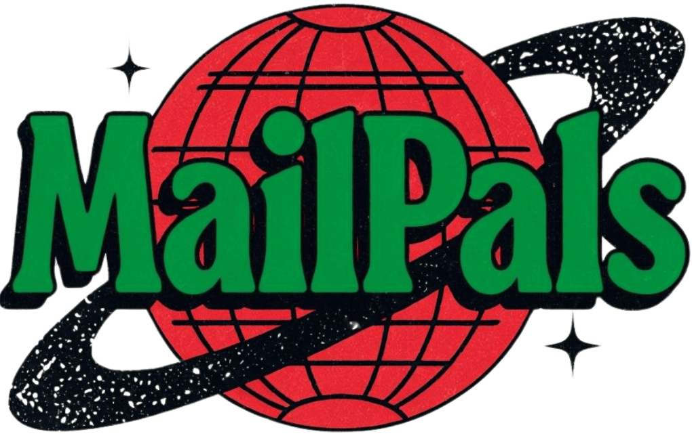

# MailPals

Private group newsletters for friends, families & teams

Stay in touch, grow closer together, and discover things you never knew with the people in your life.

### How it works

1. Pick inquisitive questions: Choose from dozens of thoughtful questions or add your own.
2. Invite your inner circle: We use email. Just add your members and we'll take care of the rest.
3. Share an experience: Get everyone's stories in a fun and beautiful email.

### Use Cases
MailPals brings people closer, no matter the distance.

**Families:** Stay connected with siblings and parents across the country, building stronger bonds.

**Teams:** Busy teammates stay engaged by sharing thoughtful questions and responses.

**Universities:** Reconnect with old college friends, exchange updates, share photos, and offer support.

**Clubs & Masterminds:** Keep the conversation going by exchanging insights, opinions, and personal milestones with your meetup group.

**Friends:** Share personal updates, challenges, and goals with your closest friends, no matter where life takes you.

**Communities:** Like-minded groups exchange stories, memes, and life updates, fostering meaningful connections.

### FAQ
**What is MailPals and how does it work?**
MailPals is a fun way to have a group newsletter without the work. You pick the questions for your group to answer, then MailPals creates a fun and beautiful newsletter with everyone's replies. All you need is to do is invite your people!

**What are the questions and who chooses them?**
We automatically select from a set of questions designed to spark fun and thoughtful replies. The questions range from updates about your week to thoughts on identity, life stories, and personal philosophies.
Each newsletter cycle, we'll suggest a few questions for you. You can always swap questions or add your own.

### The Email
At the set interval, MailPals will send an email to your group with the newsletter. The email will include the questions and answers from your group. It will also include a link to reply to the email with your thoughts.

Every few days before the next newsletter is sent, members who have not replied will receive a follow-up email with a link to answer the next newsletters questions.

<!-- The email will look like this:

The delivery will look like this:

 -->

## Getting Started

These instructions will get you a copy of the project up and running on your local machine for development and testing purposes. See deployment for notes on how to deploy the project on a live system.

### Prerequisites

I use [asdf](https://asdf-vm.com/guide/getting-started.html) to manage my Ruby versions. If you have asdf installed it will automatically install the correct version of Ruby from the `.tool-versions` file.

### Development

1. Clone the repo
2. Run `bin/setup` to install dependencies, prepare the database, and start the development server.

Subsequently, use `bin/dev` to start the development server. (see Procfile.dev)

<!-- ## Testing

Testing is not yet implemented. Any existing tests are autogenerated by Rails and not used or accurate. -->

## Deployment

We use [Kamal](https://kamal-deploy.org/) to deploy the app. For [mailpals.net](https://mailpals.net), we use a single Hetzner server that [4till2](https://github.com/4till2) maintains. To deploy your own copy, you can fork this repo and change the deploy.yml file to deploy to your own infrastructure.

## Built With

* Ruby on Rails 8
* TailwindCSS
* Hotwire (Turbo, Stimulus, Importmaps)
* Sqlite
* Kamal 2 (for deployment on a single Hetzner server)
* Resend (for email delivery)

## Contributing

Please read [CONTRIBUTING.md](/CONTRIBUTING.md) for details on our code of conduct, and the process for submitting pull requests to us.

## Versioning

We use [SemVer](http://semver.org/) for versioning. For the versions available, see the [tags on this repository](https://github.com/your/project/tags). 

## Authors

* **Yosef Serkez** - *Initial work* - [4till2](https://github.com/4till2)

<!-- See also the list of [contributors](https://github.com/your/project/contributors) who participated in this project. -->

## License

This project is licensed under the MIT License - see the [LICENSE.md](LICENSE.md) file for details

<!-- ## Acknowledgments -->
